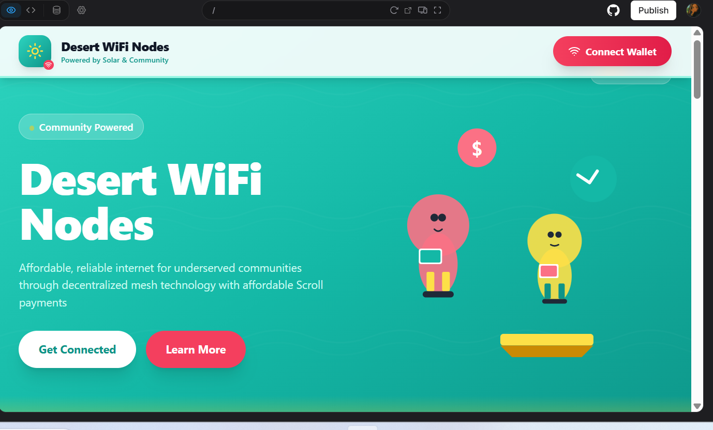

# Desert WiFi Nodes

A decentralized, community-owned WiFi network platform powered by solar energy and Scroll blockchain payments. This project aims to bridge the digital gap by providing affordable, reliable internet access to underserved communities.



## Overview

Desert WiFi Nodes is a web application that enables communities to establish and manage their own solar-powered WiFi mesh networks. Users can connect to local nodes, make affordable payments via cryptocurrency on the Scroll network, and track their usage through an intuitive dashboard.

## Features

- **Smart Contract Integration**: Fully functional Solidity smart contract on Scroll network
- **Wallet Integration**: Connect via MetaMask or other Web3 wallets
- **Real Payments**: Make actual blockchain payments for WiFi access
- **Node Registration**: Register and manage WiFi nodes on-chain
- **User Dashboard**: Real-time network metrics and payment history from blockchain
- **Payment Tracking**: View on-chain transaction history and node usage
- **Earnings Withdrawal**: Node operators can withdraw earnings from smart contract
- **Community Focus**: Built for community ownership and sustainability
- **Solar-Powered**: 100% renewable energy network infrastructure
- **Secure & Private**: Decentralized mesh network with encrypted connections

## Tech Stack

- **Frontend**: React 18 + TypeScript
- **Styling**: Tailwind CSS
- **Icons**: Lucide React
- **Build Tool**: Vite
- **Blockchain**: Scroll Network (L2 Ethereum)
- **Smart Contract**: Solidity 0.8.20+
- **Web3 Library**: Ethers.js v6
- **Wallet**: MetaMask / Web3 Compatible

## Project Architecture

### Application Structure

```
desert-wifi-nodes/
├── contracts/
│   └── DesertWifiNodes.sol      # Main smart contract
├── src/
│   ├── components/
│   │   ├── Navbar.tsx           # Navigation with wallet connect
│   │   ├── Hero.tsx             # Landing page hero section
│   │   ├── HowItWorks.tsx       # 3-step process explanation
│   │   ├── CommunityOwnership.tsx # Feature showcase
│   │   ├── Dashboard.tsx        # User dashboard with blockchain data
│   │   ├── PaymentModal.tsx     # Payment interface for smart contract
│   │   └── Footer.tsx           # Site footer
│   ├── contexts/
│   │   └── Web3Context.tsx      # Web3 provider and hooks
│   ├── contracts/
│   │   └── desertWifiNodesConfig.ts # Contract ABI and configuration
│   ├── App.tsx                  # Main app component & routing
│   ├── main.tsx                 # Application entry point
│   └── index.css                # Global styles & Tailwind
├── public/                      # Static assets
├── DEPLOYMENT.md                # Smart contract deployment guide
└── dist/                        # Production build
```

### Component Architecture

```
App (Root)
├── State Management
│   ├── showDashboard (boolean)
│   └── isWalletConnected (boolean)
│
├── Landing Page View
│   ├── Navbar
│   ├── Hero
│   ├── HowItWorks
│   ├── CommunityOwnership
│   └── Footer
│
└── Dashboard View (Authenticated)
    ├── Header (with disconnect)
    ├── Stats Cards
    ├── Payment History Table
    └── Footer
```

## User Flow Diagram

```
┌─────────────────────────────────────────────────────────────┐
│                      Landing Page                            │
│  ┌────────────┐  ┌────────────┐  ┌──────────────────────┐  │
│  │   Hero     │  │ How It     │  │  Community           │  │
│  │  Section   │  │  Works     │  │  Ownership           │  │
│  └────────────┘  └────────────┘  └──────────────────────┘  │
└─────────────────────────────────────────────────────────────┘
                            │
                            │ Click "Connect Wallet"
                            ▼
                  ┌──────────────────┐
                  │  MetaMask Popup  │
                  │  Authorization   │
                  └──────────────────┘
                            │
                ┌───────────┴────────────┐
                │                        │
         User Approves            User Rejects
                │                        │
                ▼                        ▼
    ┌──────────────────────┐    Stay on Landing Page
    │   User Dashboard     │
    │                      │
    │  ┌────────────────┐ │
    │  │ Network Stats  │ │
    │  ├────────────────┤ │
    │  │ Payment        │ │
    │  │ History        │ │
    │  ├────────────────┤ │
    │  │ Add Funds CTA  │ │
    │  └────────────────┘ │
    └──────────────────────┘
                │
                │ Click "Disconnect"
                ▼
         Return to Landing Page
```

## Payment Flow (Scroll Network)

```
┌──────────────┐
│   User       │
│   Wallet     │
└──────┬───────┘
       │ 1. Connect Wallet
       ▼
┌──────────────────┐
│  MetaMask/Web3   │
│   Provider       │
└──────┬───────────┘
       │ 2. Request Access
       ▼
┌──────────────────────────────────┐
│   Scroll Network (L2)            │
│                                  │
│  ┌────────────────────────────┐ │
│  │  Smart Contract            │ │
│  │  - Payment Processing      │ │
│  │  - Node Registration       │ │
│  │  - Usage Tracking          │ │
│  └────────────────────────────┘ │
└──────────────────────────────────┘
       │ 3. Transaction Confirmed
       ▼
┌──────────────────┐
│   Dashboard      │
│   - Update Stats │
│   - Show History │
└──────────────────┘
```

## Data Flow Architecture

```
┌─────────────────────────────────────────────────────────────┐
│                     Frontend (React)                         │
│                                                              │
│  ┌──────────────┐         ┌──────────────────────────────┐ │
│  │   App.tsx    │────────▶│  Component State             │ │
│  │              │         │  - isWalletConnected         │ │
│  │              │         │  - showDashboard             │ │
│  └──────┬───────┘         └──────────────────────────────┘ │
│         │                                                    │
│  ┌──────┴───────────────────────────────────────────────┐  │
│  │              Component Layer                          │  │
│  │  ┌──────────┐  ┌──────────┐  ┌──────────────────┐   │  │
│  │  │ Navbar   │  │   Hero   │  │   Dashboard      │   │  │
│  │  └──────────┘  └──────────┘  └──────────────────┘   │  │
│  └───────────────────────────────────────────────────────┘  │
│                                                              │
│  ┌──────────────────────────────────────────────────────┐  │
│  │              Web3Context Provider                     │  │
│  │  - Wallet connection management                       │  │
│  │  - Contract interaction methods                       │  │
│  │  - Network statistics fetching                        │  │
│  └──────────────────────────────────────────────────────┘  │
└─────────────────────────────────────────────────────────────┘
                            │
                            │ Ethers.js / Web3 Provider
                            ▼
                  ┌──────────────────┐
                  │   MetaMask API   │
                  │  (Web3 Wallet)   │
                  └──────────────────┘
                            │
                            ▼
┌─────────────────────────────────────────────────────────────┐
│                  Scroll Network (Blockchain)                 │
│                                                              │
│  ┌──────────────────────────────────────────────────────┐  │
│  │  DesertWifiNodes Smart Contract                      │  │
│  │  - Node registration and management                  │  │
│  │  - Payment processing                                │  │
│  │  - Earnings distribution                             │  │
│  │  - Network statistics tracking                       │  │
│  │  - Access control and security                       │  │
│  └──────────────────────────────────────────────────────┘  │
└─────────────────────────────────────────────────────────────┘
```

## Getting Started

### Prerequisites

- Node.js 18+
- npm or yarn
- MetaMask browser extension (for wallet functionality)
- ETH on Scroll Sepolia testnet (get from [Scroll Faucet](https://sepolia.scroll.io/faucet))

### Installation

1. Clone the repository:
```bash
git clone <repository-url>
cd desert-wifi-nodes
```

2. Install dependencies:
```bash
npm install
```

3. Deploy the Smart Contract:
   - Follow the detailed instructions in [DEPLOYMENT.md](./DEPLOYMENT.md)
   - Deploy `contracts/DesertWifiNodes.sol` to Scroll Sepolia or Scroll Mainnet
   - Copy the deployed contract address

4. Set up environment variables:
```bash
# Copy the example file
cp .env.example .env

# Edit .env and add your contract address
VITE_CONTRACT_ADDRESS=0xYourContractAddressHere
```

5. Start the development server:
```bash
npm run dev
```

6. Open your browser and navigate to `http://localhost:5173`

7. Connect your MetaMask wallet
   - Ensure you're on the Scroll network (Sepolia testnet or mainnet)
   - Click "Connect Wallet" in the application
   - Approve the connection in MetaMask

### Build for Production

```bash
npm run build
```

The production-ready files will be in the `dist/` directory.

### Preview Production Build

```bash
npm run preview
```

## Features in Detail

### 1. Smart Contract
The DesertWifiNodes smart contract provides:
- **Node Registration**: On-chain registration of WiFi nodes with location and pricing
- **Payment Processing**: Secure payment handling with automatic fund distribution
- **Earnings Management**: Node operators can withdraw earnings anytime
- **Network Statistics**: Real-time tracking of nodes, users, and transaction volume
- **Access Control**: Only node owners can manage their nodes

### 2. Wallet Connection
Users connect their Web3 wallet (MetaMask) to access the platform. The app automatically switches to the Scroll network and establishes a connection to the deployed smart contract.

### 3. Dashboard
After connecting, users see real-time data from the blockchain:
- **Active Nodes**: Number of operational WiFi nodes on the network
- **Connected Users**: Total unique users who have made payments
- **Total Volume**: Total transaction volume in ETH processed through the contract
- **Network Uptime**: Network reliability metrics

### 4. Payment System
Users can make payments through an intuitive modal:
- Select a node by ID
- Choose duration (1, 6, 12, or 24 hours)
- Enter payment amount in ETH
- Transaction is processed on-chain with MetaMask confirmation

### 5. Payment History
Dashboard displays user's on-chain transaction history:
- Transaction date from blockchain timestamp
- Node ID that received the payment
- Payment amount in ETH
- All transactions are verified on-chain

### 6. Landing Page
Educates visitors about:
- How the decentralized system works (3-step process)
- Community ownership model
- Solar-powered infrastructure
- Blockchain security and privacy features

## Smart Contract Functions

### For Users
- `makePayment(nodeId, duration)` - Pay for WiFi access time
- `getUserPayments(address)` - View your payment history
- `getNetworkStats()` - Get real-time network statistics

### For Node Operators
- `registerNode(location, pricePerHour)` - Register a new WiFi node
- `updateNodePrice(nodeId, newPrice)` - Update hourly pricing
- `withdrawEarnings(nodeId)` - Withdraw accumulated earnings
- `deactivateNode(nodeId)` / `reactivateNode(nodeId)` - Manage node status

### View Functions
- `getNode(nodeId)` - Get detailed node information
- `getUserNodes(address)` - List nodes owned by an address
- `getNodePayments(nodeId)` - View payments received by a node
- `calculateUptime(nodeId)` - Calculate node uptime percentage

## Future Enhancements

### Smart Contract Upgrades
- Staking mechanism for node operators
- Governance token for community decisions
- Multi-tier pricing models
- Subscription-based payments
- Referral rewards system

### Additional Features
- Mobile app (React Native)
- Enhanced node operator portal with analytics
- Advanced dashboard with charts and graphs
- Multi-language support
- Geographic node mapping with real-time availability
- Bandwidth monitoring and QoS tracking
- Integration with additional L2 networks
- NFT-based node ownership certificates

## Network Architecture

### Mesh Network Topology

```
        ☀️ Solar Panel
           │
      ┌────┴────┐
      │  Node A │◄──────┐
      └────┬────┘       │
           │            │
     ┌─────┼─────┐      │
     │     │     │      │
┌────▼──┐ ┌▼────┐ ┌────▼──┐
│Node B │ │Node C│ │Node D │
└───────┘ └──────┘ └───────┘
    │        │         │
    └────────┼─────────┘
             │
        ┌────▼────┐
        │  Users  │
        └─────────┘
```

Each node:
- Runs on solar power
- Connects to multiple other nodes (mesh)
- Serves local users
- Processes Scroll payments
- Reports stats to network

## Development

### Available Scripts

- `npm run dev` - Start development server
- `npm run build` - Build for production
- `npm run preview` - Preview production build
- `npm run lint` - Run ESLint
- `npm run typecheck` - Run TypeScript type checking

### Code Structure

The application follows a component-based architecture:

1. **App.tsx**: Main application logic and routing
2. **Components**: Reusable UI components
3. **Hooks**: Custom React hooks (future)
4. **Utils**: Helper functions and utilities (future)
5. **Types**: TypeScript type definitions (future)

### Styling

Tailwind CSS utility classes are used throughout for consistent styling:
- **Teal**: Primary color (network/tech theme)
- **Coral**: Secondary color (warmth/community)
- **Sunny Yellow**: Accent (solar energy)

## Contributing

Contributions are welcome! Please follow these guidelines:

1. Fork the repository
2. Create a feature branch (`git checkout -b feature/amazing-feature`)
3. Commit your changes (`git commit -m 'Add amazing feature'`)
4. Push to the branch (`git push origin feature/amazing-feature`)
5. Open a Pull Request

## Security

- All wallet connections use standard Web3 providers
- No private keys are stored or transmitted
- Row Level Security (RLS) enabled on database (when integrated)
- HTTPS required for production deployments

## License

This project is open source and available under the MIT License.

## Support

For issues, questions, or contributions, please open an issue on the GitHub repository.

## Acknowledgments

- Built with React and Vite
- Powered by Scroll Network for affordable transactions
- Inspired by community-driven connectivity initiatives
- Solar energy advocacy for sustainable technology

---

**Built with ❤️ for underserved communities worldwide**
